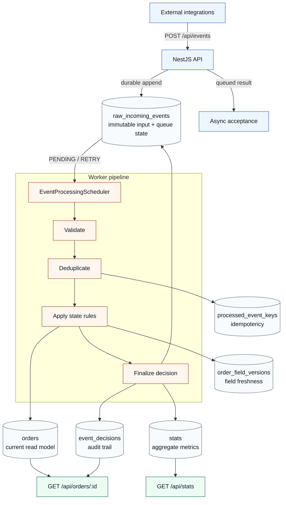
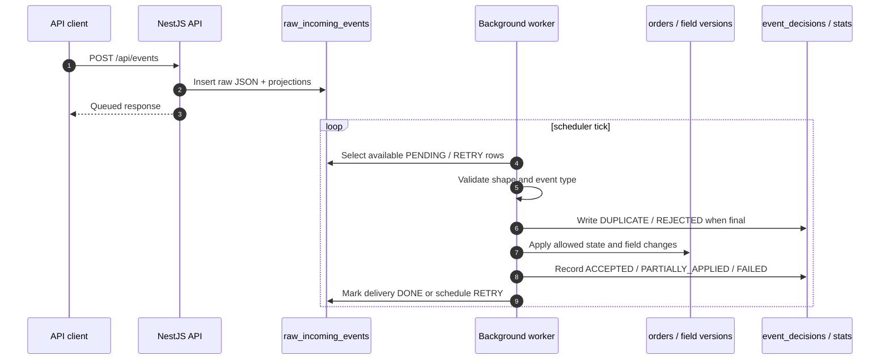
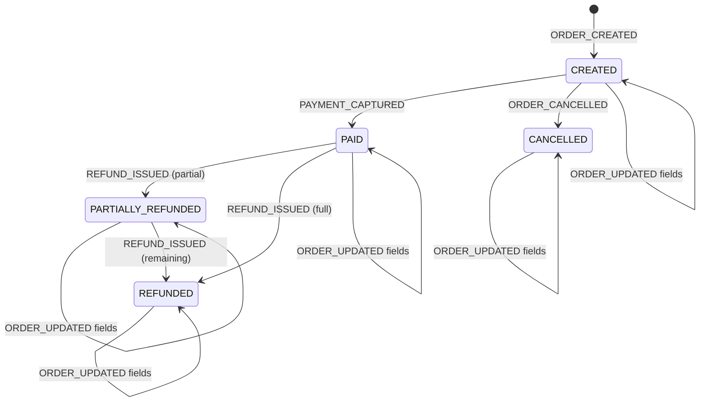
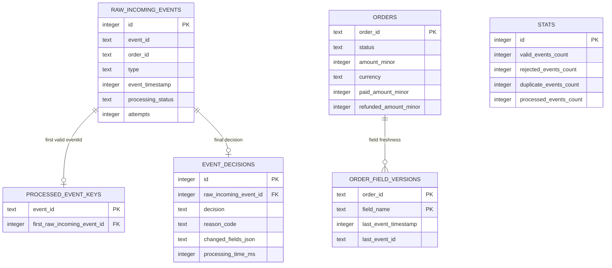

<div align="center">

# Event Processing Engine

**Reliable order state from unreliable asynchronous events.**

[Live Demo](https://event-processing-engine.julianowicka.dev/) |
[Architecture Docs](./docs/README.md) | [Deployment](./deploy/README.md)


</div>

## Processing Architecture



The HTTP request is intentionally small: it durably accepts input and returns
queued results. The worker later performs validation, deduplication, business
rules, retries, state updates, audit writes, and statistics updates.

## State Pattern Core

Order transition logic is implemented with the
[State pattern](https://refactoring.guru/design-patterns/state). Instead of a
large conditional tree for every possible order status, the worker delegates
event handling to a status-specific handler selected by `OrderStatus`.

| State Pattern role | Implementation                                                                                                                                                                            |
| ------------------ | ----------------------------------------------------------------------------------------------------------------------------------------------------------------------------------------- |
| Context            | Event processing flow resolves the current order status before applying a delivery.                                                                                                       |
| State interface    | `OrderEventHandler` declares handlers for order lifecycle events.                                                                                                                         |
| Concrete states    | `OrderCreatedEventHandler`, `OrderPaidEventHandler`, `OrderCancelledEventHandler`, `OrderPartiallyRefundedEventHandler`, `OrderRefundedEventHandler`, and `NonExistentOrderEventHandler`. |
| State selection    | `OrderEventHandlerFactory` discovers `@HandlesOrderStatus(...)` providers and returns the handler for the current status.                                                                 |

This keeps state-specific rules close to the state that owns them: for example,
`PAYMENT_CAPTURED` can be valid for `CREATED`, rejected for `PAID`, and
impossible for `CANCELLED`, without burying those cases in one sprawling
dispatcher.

## Why This Exists

External integrations rarely send clean event streams. Deliveries can be
duplicated, delayed, malformed, stale, or only partially describe the latest
state. This engine accepts those events asynchronously and turns them into a
consistent order read model with an explicit audit trail for every final
decision.

| Area        | Implementation                                                                      |
| ----------- | ----------------------------------------------------------------------------------- |
| Ingestion   | `POST /api/events` stores every raw delivery and returns queued results.            |
| Processing  | A background scheduler processes `PENDING` and `RETRY` rows in deterministic order. |
| Idempotency | `processed_event_keys.event_id` claims the first valid external event id.           |
| Ordering    | `eventTimestamp ASC NULLS LAST`, then raw delivery `id ASC`.                        |
| Merging     | `order_field_versions` applies newer fields without erasing missing ones.           |
| Audit       | `event_decisions` records one final outcome per delivery.                           |
| Storage     | SQLite file with TypeORM migrations and schema sync disabled.                       |

## Event Lifecycle



## Order State Machine



Lifecycle status is owned by lifecycle events. `ORDER_UPDATED.payload.status`
is accepted as input, but it is not authoritative; payment, cancellation, and
refund transitions must come from their domain event types.

## Decision Outcomes

| Decision            | Meaning                                                                 |
| ------------------- | ----------------------------------------------------------------------- |
| `ACCEPTED`          | The event changed order state.                                          |
| `PARTIALLY_APPLIED` | Newer fields were applied while stale or forbidden fields were skipped. |
| `REJECTED`          | The event was invalid, obsolete, or violated a business rule.           |
| `DUPLICATE`         | A valid `eventId` was already claimed by an earlier delivery.           |
| `FAILED`            | An unexpected technical failure exhausted the retry limit.              |

Missing-order events are retried on a bounded delay before they become a final
`ORDER_NOT_READY` rejection. Retry attempts are lifecycle metadata, not audit
decisions.

## Persistence Model



The full schema and trade-offs are documented in
[docs/database.md](./docs/database.md). The worker flow is documented in
[docs/processing-flow.md](./docs/processing-flow.md).

## Quick Start

```bash
docker compose up --build
```

| Service     | URL / path                                        |
| ----------- | ------------------------------------------------- |
| API         | `http://localhost:3100/api`                       |
| Frontend    | `http://localhost:8080`                           |
| SQLite file | `./data/app.sqlite` mounted as `/data/app.sqlite` |

Verbose worker logs:

```bash
EVENT_WORKER_VERBOSE_LOGS=true docker compose up --build
```

Follow processing:

```bash
docker compose logs -f api
```

## API

| Method | Path              | Purpose                                                                    |
| ------ | ----------------- | -------------------------------------------------------------------------- |
| `POST` | `/api/events`     | Store a batch of events for async processing.                              |
| `GET`  | `/api/orders/:id` | Read current state, history, rejected events, pending jobs, and audit log. |
| `GET`  | `/api/stats`      | Read valid, rejected, duplicate, and average processing time metrics.      |
| `GET`  | `/api/health`     | Check service status and configured database path.                         |

Example batch:

```bash
curl -X POST http://localhost:3100/api/events \
  -H "Content-Type: application/json" \
  -d '[
    {
      "eventId": "evt-1001",
      "orderId": "ord-501",
      "type": "ORDER_CREATED",
      "timestamp": 1710000900,
      "payload": {
        "amount": 199.99,
        "currency": "PLN"
      }
    }
  ]'
```

Queued response:

```json
{
  "mode": "ASYNC_WORKER",
  "results": [
    {
      "incomingEventId": 1,
      "eventId": "evt-1001",
      "orderId": "ord-501",
      "type": "ORDER_CREATED",
      "status": "QUEUED",
      "reasonCode": null,
      "reasonMessage": "Queued for asynchronous processing",
      "processingTimeMs": 0
    }
  ],
  "summary": {
    "queued": 1
  }
}
```

## Local Development

Requirements:

- Node.js `24.11+`
- Yarn

```bash
yarn install
yarn start:dev
```

By default the API writes to `data/app.sqlite`. Override the database file with:

```bash
SQLITE_DB_PATH=/absolute/path/app.sqlite yarn start:dev
```

Migrations run automatically on application startup. They can also be inspected
or run explicitly:

```bash
yarn migration:show
yarn migration:run
yarn migration:revert
```

## Test And Build

```bash
yarn test
yarn test:e2e
yarn test:e2e --runTestsByPath ./test/__tests__/recruitment-requirements.e2e-spec.ts
yarn build
```

The recruitment acceptance e2e test above runs locally against an isolated
temporary SQLite database and checks the task requirements end to end:
deduplication, out-of-order events, partial updates, invalid events, state
transitions, audit log, order history, and stats.

Deployed smoke/load tests are opt-in because they write synthetic `smoke-*`,
`hostile-*`, `dupe-*`, and `load-*` events to the target database:

```bash
E2E_BASE_URL=https://event-processing-engine.julianowicka.dev yarn test:e2e:deployed

E2E_BASE_URL=https://event-processing-engine.julianowicka.dev \
E2E_RUN_LOAD=true \
E2E_LOAD_REQUESTS=1000 \
E2E_LOAD_CONCURRENCY=25 \
yarn test:e2e:deployed
```

`E2E_BASE_URL` selects the deployed API origin, `E2E_RUN_LOAD=true` enables the
load probe, and `E2E_LOAD_REQUESTS` / `E2E_LOAD_CONCURRENCY` control its volume.

## Project Map

| Path                           | Notes                                                                        |
| ------------------------------ | ---------------------------------------------------------------------------- |
| [src/events](./src/events)     | Event ingestion, scheduling, validation, decisions, and business processing. |
| [src/orders](./src/orders)     | Order read model API and response composition.                               |
| [src/database](./src/database) | TypeORM entities, repositories, migrations, and transaction boundary.        |
| [src/stats](./src/stats)       | Processing statistics endpoint and service.                                  |
| [frontend](./frontend)         | Small nginx-served inspector UI for the API.                                 |
| [docs](./docs/README.md)       | Deep-dive architecture notes and edge-case decisions.                        |
| [deploy](./deploy/README.md)   | Production VPS, GHCR, Caddy, and Docker Compose deployment notes.            |

## Design Docs

- [API Contract](./docs/api-contract.md)
- [Processing Flow](./docs/processing-flow.md)
- [Database](./docs/database.md)
- [State Machine](./docs/state-machine.md)
- [Merging Strategies](./docs/merging-strategies.md)
- [Error Handling](./docs/error-handling.md)
- [Testing Scenarios](./docs/testing-scenarios.md)

## Production Deployment

Production runs the API and frontend as separate containers behind the existing
Caddy reverse proxy, with SQLite stored in a dedicated Docker volume. See
[deploy/README.md](./deploy/README.md) for VPS, DNS, GHCR, and deployment
setup.
