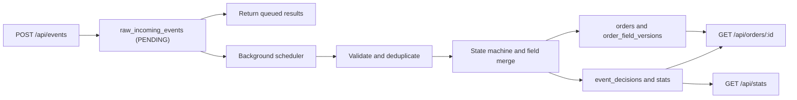

# Event Processing Engine Architecture

This folder contains documentation for the implemented order event processing
engine.

The primary design documents are:

- [API Contract](./api-contract.md)
- [Database](./database.md)
- [Processing Flow](./processing-flow.md)

## Current Decisions

- Runtime: Node.js 24.11+ with TypeScript.
- Framework: NestJS with the Express adapter.
- Storage: a local SQLite database file.
- Ingestion: `POST /api/events` persists every raw delivery and returns queued
  results promptly.
- Processing: a single background scheduler processes stored deliveries later.
- Inbox lifecycle: retry/status metadata is kept on `raw_incoming_events`;
  input JSON remains unchanged after insertion.
- Audit: `event_decisions` explicitly records one final engine outcome per
  delivery.
- History: applied decision rows contain changed/skipped fields and provide
  order history without a separate `order_history` table.
- Deduplication: the first valid `eventId` claims `processed_event_keys`.
- Merging: `order_field_versions` supports field-level handling of stale
  partial updates.
- Status ownership: `ORDER_UPDATED` can update descriptive fields such as
  amount and currency; payment, cancellation, and refund events own lifecycle
  status transitions.
- Statistics: one `stats` row keeps required counters fast to read.
- Technical failures: exhausted retries produce a final `FAILED` decision.
- Scope reduction: no multi-worker locking is required; missing-order events
  use a bounded 10-second retry before final rejection.

## Current Flow

## Supporting Documents

- [State Machine](./state-machine.md)
- [Merging Strategies](./merging-strategies.md)
- [Edge Cases](./edge-cases.md)
- [Error Handling](./error-handling.md)
- [Multi-threading](./multi-threading.md)
- [Testing Scenarios](./testing-scenarios.md)
- [Technology Stack](./technology-stack.md)
- [Quality Plan](./quality-plan.md)
- [Implementation Roadmap](./implementation-roadmap.md)
- [Authentication](./authentication.md)
