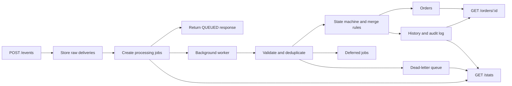

# Event Processing Engine Architecture

This folder documents the implemented MVP for the order event processing
recruitment task.

## Core Decisions

- Runtime: Node.js with TypeScript.
- Framework: NestJS 11 with the Express adapter.
- Storage: local SQLite database file at `data/app.sqlite`.
- Ingestion: `POST /events` stores every raw delivery.
- Inbox model: `raw_incoming_events` is append-only; `event_processing_jobs`
  stores processing state.
- Processing: `EventWorkerService` processes available jobs in the background
  after ingestion.
- Deduplication: first valid `eventId` claims the key; later deliveries are
  `DUPLICATE`.
- Ordering: processing uses raw delivery order; timestamps drive merge rules.
- Out-of-order before create: valid jobs are `DEFERRED` and retried later.
- Retry behavior: deferred business jobs are retried by the worker.
- Merge strategy: set-like fields use strict newer-timestamp wins; same timestamp
  keeps the first accepted value.
- Financial events: payment/refund events are cumulative facts, not generic field
  overwrites.
- Dead-letter queue: technical worker failures are retried up to 3 times, then
  stored in `dead_letter_events`.
- Authentication: intentionally disabled for the MVP.

## Flow

## Documents

- [API Contract](./api-contract.md)
- [Database](./database.md)
- [Processing Flow](./processing-flow.md)
- [State Machine](./state-machine.md)
- [Merging Strategies](./merging-strategies.md)
- [Edge Cases](./edge-cases.md)
- [Error Handling](./error-handling.md)
- [Multi-threading](./multi-threading.md)
- [Testing Scenarios](./testing-scenarios.md)
- [Technology Stack](./technology-stack.md)
- [Quality Plan](./quality-plan.md)
- [Implementation Roadmap](./implementation-roadmap.md)
- [Authentication](./authentication.md)
